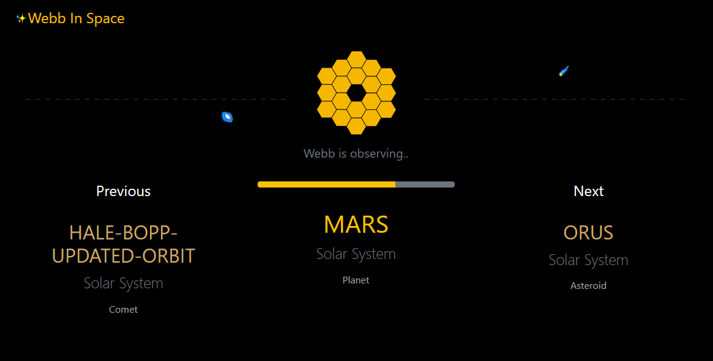

> My personal project I am developing while exploring Django and scraping in Python 🔭

# Webb In Space

It's showing what the Webb telescope is observing right now.

### The application is divided into three parts:

**Scraping the data:**
- It scrapes [this page](https://www.stsci.edu/jwst/science-execution/observing-schedules) looking for new reports and saved them into */data_source/cycle_{number}/* folder as new txt file.
- Use command: `python manage.py observation_plan_scout`.

**Parsing the data:**
- It searches the *data_source* folder looking for new files. Then parses the data in these files and saves them into the database.
- Use command: `python manage.py report_parser`.

**Showing the data on the web page:**
- Homepage shows what is the current target of the Webb's observation.

## How to install
:snake: Python 3.9 required

- Install the dependencies: `pip install -r requirements.txt`
- Apply migrations: `python manage.py migrate`
- Run the app: `python manage.py runserver`

## Built With
* [Django](https://www.djangoproject.com/) - Python web framework
* [Bootstrap](https://getbootstrap.com/) - Front-end framework
* [Mermaid](https://mermaid-js.github.io/mermaid/#/) - JavaScript-based diagramming and charting tool
