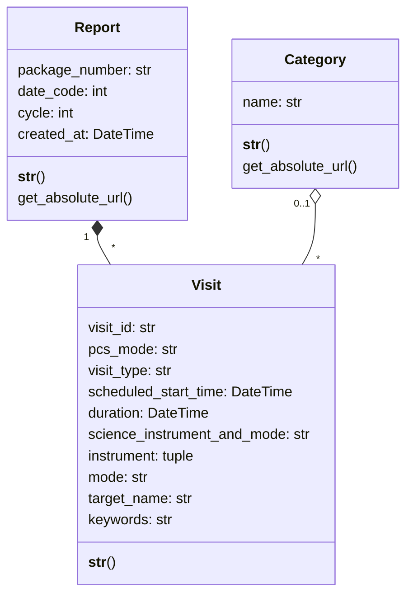

# UML Class Diagram
### for models:

```mermaid
classDiagram
    class Report{
      package_number: str
      date_code: int
      cycle: int
      created_at: DateTime
      __str__()
      get_absolute_url()
    }
    class Category{
      name: str
      __str__()
      get_absolute_url()
    }
    class Visit{
      visit_id: str
      pcs_mode: str
      visit_type: str
      scheduled_start_time: DateTime
      duration: DateTime
      science_instrument_and_mode: str
      instrument: tuple
      mode: str
      target_name: str
      keywords: str
      __str__()
    }
    Report "1" *-- "*" Visit
    Category "0..1" o-- "*" Visit
```
